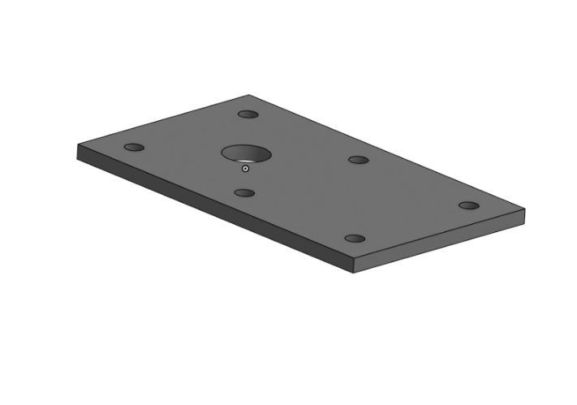
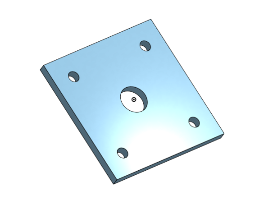
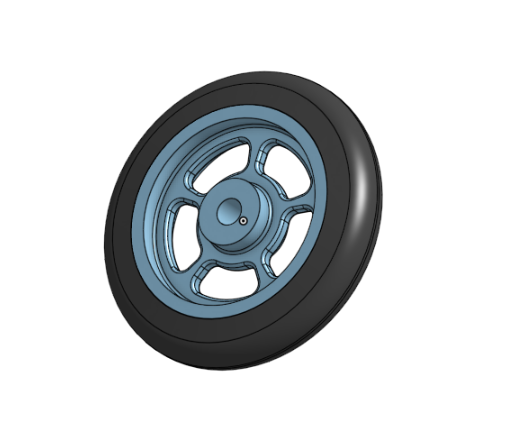
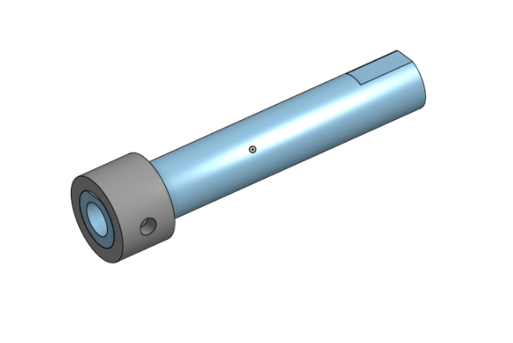
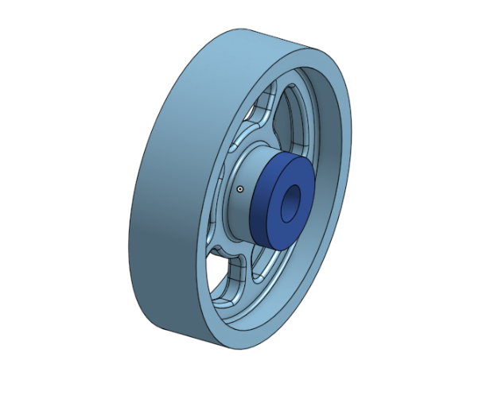
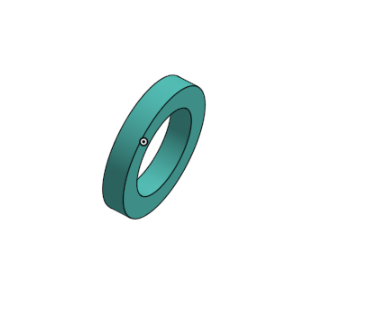
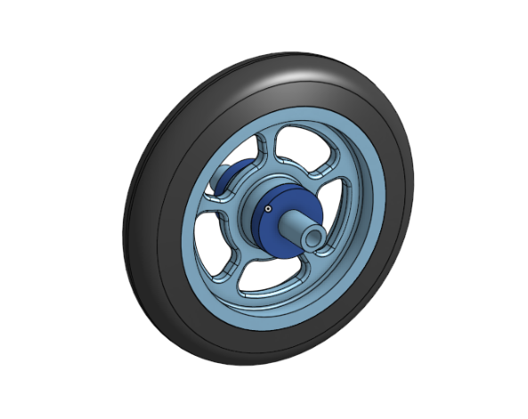
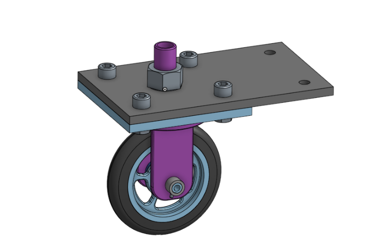

# BasicCAD

We are creating a caster.

---
## Table of Contents
* [Table of Contents](#Table-of-Contents)
* [Base](#Base)
* [Mount](#Mount)
* [Fork](#Fork)
* [Tire](#Tire)
* [Wheel](#Wheel)
* [Axle Collar Bearings](#Axle-Collar-Bearings)
* [Sub Assembly](#Sub-Assembly)
* [Final Assembly](#Final-Assembly)

## Base

### Description

The first assignment was to create the caster base. The base's dimensions are 200 mm x 120 mm and 8 mm thick. It has 6 holes 10 mm wide and 20 mm from the edge equally spaced along the edges.

### Evidence
[The Base in Onshape](https://cvilleschools.onshape.com/documents/2bc111947c86e4d9cce731a5/w/12fc130059ca3c3467038942/e/550caf273486843a56aec010)

### Image

### Reflection

This was my first Onshape part and [following along with Dr. Shields made it super easy.](https://www.youtube.com/watch?v=93BFUD-HAG8&feature=emb_title&scrlybrkr=5670f0b4)  I learned about 
* sketching (shortcut **shift-s**)
* constructions lines (shortcut **Q**)
* dimensions (shortcut **D**)
* extruding both add and remove (shortcut key **E**)
* linear patterns (no shortcut)

Onshape is awesome.  I found it really helpful to rename all my sketches.  It is going to be a GREAT year in engineering.

---

## Mount

### Description

The second assignment was to create the caster mount.  The caster's dimensions are 120 mm x 120 mm and 8 mm thick.  It has 4 holes 10 mm wide and 20 mm from the edge equally spaced along the edges. It also has a 25 mm hole in it's center.

### Evidence

[The Mount in Onshape](https://cvilleschools.onshape.com/documents/a160509bbb41c62279e81e84/w/e183be213f2f0196c51562ae/e/ac3c07bc44e1980bf50b0171)

### Image

### Reflection

---

## Fork

### Description

The third assignment was to create the caster fork. This part has more steps then the last two, it's less simple.The forks's first part starts with an 8mm thick, 60 mm centered-at-origin cylinder. On the face of that cylinder a rectangle is drawn with the dimensions 40 mm x 5 mm, 15 mm from origin. The rectangle is extruded 75 mm turning into the arm, and then moderated with three fillets. The first pair of fillets are 15 mm at the edges, then 1 mm filets on the front and back of the edges, and a 4 mm fillet around the base. The arm is mirrored along with all it's features along the cylinder's plane. Then a hole is made through the arms faces with a diameter of 10 mm and positioned 15mm from the tops.Then on to the shaft which is on the opposite side of where the arms where made. The shaft is made of two concentric circles at the orgin, with diameters 15 mm and 20 mm and it is extruded 60 mm. To finish it off, there are 1mm chamfers added to the edges of the cylinder and the shaft.

### Evidence

[The Fork in Onshape](https://cvilleschools.onshape.com/documents/0fac2384f00399d820b24ba4/w/351784f1dac815f7f286a803/e/e27f40e94e2839e5c229139c)

### Image

### Reflection

---

## Tire

### Description

The four assignment was to create the caster tire. 

### Evidence

[The Tire in Onshape](https://cvilleschools.onshape.com/documents/00444a32642dbf0144e08a1b/w/71a1083707b44369f047d492/e/c2dc15467f0f14203ef6f333)

### Image

### Reflection

---

## Wheel

### Description

The fifth assignment was to create the caster wheel.

### Evidence

[The Wheel in Onshape](https://cvilleschools.onshape.com/documents/00444a32642dbf0144e08a1b/w/71a1083707b44369f047d492/e/c2dc15467f0f14203ef6f333)

### Image

### Reflection

---

## Axle Collar Bearings

### Description

The sixth,seventh,and eighth assignment was to create the caster axle,collar, and bearings.

### Evidence

[The Axle,Collar & Bearings in Onshape](https://cvilleschools.onshape.com/documents/3b1189c1b0995d2068ef9d66/w/97b0c4b4f27507f322f2801e/e/8840a9380377639b5b5a7e95)
[Bearing in Onshape](https://cvilleschools.onshape.com/documents/00444a32642dbf0144e08a1b/w/71a1083707b44369f047d492/e/c2dc15467f0f14203ef6f333)
[Big Bearing in Onshape](https://cvilleschools.onshape.com/documents/55af36a62d301e925eb69d9b/w/86cb498a5291b7d0d6cec7c2/e/0160b0dc7b1c865c619c7d04)

### Image

### Reflection

---

## Sub Assembly

### Description

The ninth assignment was to put together the caster sub assembly. This consisted of putting together the tire, wheel, axle, and two of the bearings.

### Evidence

[The Sub Assembly in Onshape](https://cvilleschools.onshape.com/documents/159a49df6ca87909de6e0782/w/535488f2ab318f0d62ac3fe1/e/3a24cc392f4cde26184581eb)

### Image

### Reflection

---

## Final Assembly

### Description

Finally, the last and final assignment, number 10, the Final Assembly. This is where everything came together.

### Evidence

[The Final Assembly in Onshape](https://cvilleschools.onshape.com/documents/26df25339861c27af39c82f7/w/696b7892e9419995c8ae5727/e/0d2b207502a377527b096e02)

### Image

### Reflection
